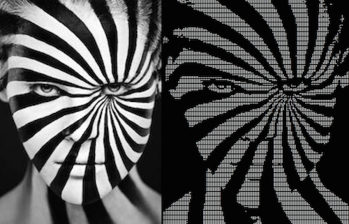

# Dot Matrix

A simple and fun package & command-line utility for encoding images to all-braille unicode representations. It can be used as a standalone command-line utility or as a package.

Currently only jpeg, static gif, and png types are supported.

[Godocs](https://godoc.org/github.com/kevin-cantwell/dotmatrix)

## Package

```go
import (
  "image"
  "os"
  "github.com/kevin-cantwell/dotmatrix"
)

func encode(img image.Image, opts ...dotmatrix.ImageOpt) error
  enc := dotmatrix.NewImageEncoder(os.Stdout, opts...)
  return enc.Encode(img)
}
```

## Command-Line Utility

```
# Install Go, then:
$ go get -u github.com/kevin-cantwell/dotmatrix/cmd/dotmatrix
```

#### Flags

```
--luminosity, -l "0.5"     Percentage value, between 0 (all black) and 1 (all white). Defaults to 0.5.
--invert, -i               Inverts colors.
--dimensions, -d "178,51"  Comma-delimited width and height of output. The default output is constrained by the terminal size.
--help, -h                 show help
--version, -v              print the version
```

#### Example

```
$ dotmatrix --luminosity .48 < face.jpg
⣿⣿⣿⣿⣿⣿⣿⣿⣿⣿⣿⣿⣿⣿⣿⣿⣿⣿⣿⣿⣿⣿⣿⣿⣿⣿⣿⣿⣿⣿⣿⣿⣿⣿⣿⣿⣿⣿⣿⣿⣿⣿⣿⣿⣿⣿⣿⣿⣿⣿⣿⣿⣿⣿⣿⣿⣿⣿⣿⣿⣿⣿⣿⣿⣿⣿⣿⣿⣿⣿⣿⣿⣿⣿⣿⣿⣿⣿⣿⣿
⣿⣿⣿⣿⣿⣿⣿⣿⣿⣿⣿⣿⣿⣿⣿⣿⣿⣿⣿⣿⣿⣿⣾⣿⣯⢿⣿⣿⣿⢾⣿⢿⣿⣿⣿⣿⣿⣿⣿⣿⣿⣿⣿⣿⣿⣿⣿⣿⣿⣿⣿⣿⣿⣿⣿⣿⣿⣿⣿⣿⣿⣿⣿⣿⣿⣿⣿⣿⣿⣿⣿⣿⣿⣿⣿⣿⣿⣿⣿⣿
⣿⣿⣿⣿⣿⣿⣿⣿⣿⣿⣿⣿⣿⣿⣿⣿⣿⣿⣿⣿⣿⣿⣿⣷⣿⣾⡧⠘⣿⠛⣿⠸⢻⠛⣿⣿⢿⣿⣿⣿⣿⣿⣿⣿⣿⣿⣿⣿⣿⣿⣿⣿⣿⣿⣿⣿⣿⣿⣿⣿⣿⣿⣿⣿⣿⣿⣿⣿⣿⣿⣿⣿⣿⣿⣿⣿⣿⣿⣿⣿
⣿⣿⣿⣿⣿⣿⣿⣿⣿⣿⣿⣿⣿⣿⣿⣿⣿⣿⣿⣿⣿⣿⣿⣿⣿⣿⣿⠀⠉⠀⠁⠀⠈⠀⠀⢿⠟⣾⣿⡿⢿⣿⣿⣿⣿⣿⣿⣿⣿⣿⣿⣿⠿⠷⠛⠛⣿⣿⣿⣿⣿⣿⣿⣿⣿⣿⣿⣿⣿⣿⣿⣿⣿⣿⣿⣿⣿⣿⣿⣿
⣿⣿⣿⣿⣿⣿⣿⣿⣿⣿⣿⣿⣿⣿⣿⣿⣿⣿⣿⣿⣿⣿⣿⣿⣿⣿⣿⣶⣤⡄⠀⠀⠀⠀⠀⠈⠀⠿⣿⡵⠛⢩⢿⣿⣿⣿⣿⣿⣿⣿⣿⣿⠐⢂⢔⠞⠻⠛⣻⣿⣿⣿⣿⣿⣿⣿⣽⣿⣿⣿⣿⣿⣿⣿⣿⣿⣿⣿⣿⣿
⣿⣿⣟⣽⡿⣛⡿⣿⣿⣿⣿⣿⣿⡛⢽⡝⢿⣿⣿⣿⣿⣿⣿⣿⣿⣿⣿⣿⣿⣿⣷⡀⠀⠀⠀⠀⠀⠆⠀⠀⠀⠁⠀⠹⣿⣿⣿⣿⣿⣿⣿⣿⡅⢛⡁⠀⠀⠈⠍⢻⣿⣿⣿⣿⣿⣿⡞⣻⣿⣿⣿⣿⣿⣿⣿⣿⣿⣿⣿⣿
⣿⣿⣿⡟⣰⠋⠘⠭⣿⣿⠿⠮⡑⠋⠈⠈⠁⠉⠉⠛⠻⣿⣿⣿⣿⣿⣿⣿⣿⣿⣿⣿⣷⣀⠀⠀⠀⠀⠀⠀⠀⠀⠀⠀⠸⣿⣿⣿⣿⣿⣿⣿⣯⠀⠀⠀⠀⠀⠀⠾⠻⣿⣿⣿⣿⣿⣧⣿⣿⣿⣿⣿⣿⣿⣿⣿⣿⣿⣿⣿
⣿⣿⣿⣶⣿⣶⣧⣭⠽⠛⣚⣊⡉⠀⠀⠀⠀⠀⠀⠀⠀⠈⠙⠻⣿⣿⣿⣿⣿⣿⣿⣿⣿⣿⣷⣤⡀⠀⠀⠀⠀⠀⠀⠀⠀⠉⣿⣿⣿⣿⣿⣿⣿⡇⠀⠀⠀⠀⠀⠩⢐⣿⣿⣿⣿⣿⣿⢋⣻⣿⣿⣿⣿⣿⣿⣿⣿⣿⣿⣿
⣿⣿⣿⣿⣿⣿⣿⣿⣿⣿⣿⣯⣉⠉⠀⠀⠀⠀⠀⠀⠀⠀⠀⠀⠈⠛⠻⣿⣿⣿⣿⣿⣿⣿⣿⣿⣿⣦⡄⠀⠀⠀⠀⠀⠀⠀⠈⢿⣿⣿⣿⣿⣿⣿⡆⠀⠀⠀⠀⠀⠈⣿⣿⣿⣿⣿⡇⡈⣾⢿⣿⣾⣿⣿⣿⣿⣿⣿⣿⣿
⣿⣿⣿⣿⣿⣿⣿⣿⣿⣿⣿⣿⣿⣶⣦⣤⣀⠀⠀⠀⠀⠀⠀⠀⠀⠀⠀⠈⠙⢿⣿⣿⣿⣿⣿⣿⣿⣿⣿⣦⡄⠀⠀⠀⠀⠀⠀⠈⢹⣿⣿⣿⣿⣿⣷⠀⠀⠀⠀⠀⠀⢼⣿⣿⣿⣿⡿⠈⢠⣵⣿⣿⣿⣿⣿⣿⣿⣿⣿⣿
⣿⣿⣿⣿⣿⣿⣿⣿⣿⣿⣿⣿⣿⣿⣿⣿⣿⣷⣶⣤⡀⠀⠀⠀⠀⠀⠀⠀⠀⠀⠈⠛⢿⣿⣿⣿⣿⣿⣿⣿⣿⣦⡀⠀⠀⠀⠀⠀⠀⢻⣿⣿⣿⣿⣿⣧⠀⠀⠀⠀⠀⠸⣿⣿⣿⣿⠏⠀⡀⠀⢹⣿⣿⣿⣿⣿⢻⣿⣿⣿
⣿⣿⣿⣿⣿⣿⣿⣿⣿⣿⣿⣿⣿⣿⣿⣿⣿⣿⣿⣿⣿⣶⣦⣀⠀⠀⠀⠀⠀⠀⠀⠀⠀⠙⠻⣿⣿⣿⣿⣿⣿⣿⣷⣄⠀⠀⠀⠀⠀⠈⢻⣿⣿⣿⣿⣿⡇⠀⠀⠀⠀⠀⣿⣿⣿⣿⠀⠀⠀⠀⠰⣿⣿⣿⣿⣿⢢⣿⣿⣿
⣿⣿⣿⣿⣿⣿⣿⣿⣿⣿⣿⣿⣿⣿⣿⣿⣿⣿⣿⣿⣿⣿⣿⣿⣿⣶⣦⣄⡀⠀⠀⠀⠀⠀⠀⠉⠻⣿⣿⣿⣿⣿⣿⣿⣦⠀⠀⠀⠀⠀⠈⣿⣿⣿⣿⣿⣷⠀⠀⠀⠀⠀⣿⣿⣿⣿⠀⠀⠀⠀⢰⣿⣿⣿⣿⣿⣻⣿⣿⣿
⣿⣿⣿⣿⣿⡛⠛⠻⠋⠉⠉⠀⠀⠀⠉⠉⠙⠛⠻⣿⣿⣿⣿⣿⣿⣿⣿⣿⣿⣶⣄⠀⠀⠀⠀⠀⠀⠈⠻⣿⣿⣿⣿⣿⣿⣷⡄⠀⠀⠀⠀⠘⣿⣿⣿⣿⣿⠀⠀⠀⠀⠀⣿⣿⣿⣿⠀⠀⠀⠀⢿⣿⣿⣿⡿⢺⣿⣿⣿⣿
⣿⣿⣿⣿⣯⣤⡄⣁⡄⠀⠀⠀⠀⠀⠀⠀⠀⠀⠀⠀⠉⠛⠛⠿⣿⣿⣿⣿⣿⣿⣿⣿⣶⣄⠀⠀⠀⠀⠀⠈⠻⣿⣿⣿⣿⣿⣷⠀⠀⠀⠀⠀⢹⣿⣿⣿⣿⠀⠀⠀⠀⠀⣿⣿⣿⡇⠀⠀⠀⣰⣾⣿⣿⣿⢻⣿⣿⣿⣿⣿
⠁⠙⣿⣿⣿⣿⣿⣿⣿⣿⣶⣶⣶⣤⣤⣀⠀⠀⠀⠀⠀⠀⠀⠀⠈⠙⠛⠿⣿⣿⣿⣿⣿⣿⣷⣤⡀⠀⠀⠀⠀⠉⢻⣿⣿⣿⣿⣧⠀⠀⠀⠀⠸⣿⣿⣿⣿⠀⠀⠀⠀⠀⣿⣿⣿⡇⠀⠀⠀⣿⣿⣿⣿⡀⢼⣿⣿⣿⣿⣿
⣴⣶⣿⣿⣿⣿⣿⣿⣿⣿⣿⣿⣿⣿⣿⣿⣿⣶⣶⣤⣄⡀⠀⠀⠀⠀⠀⠀⠈⠙⠛⢿⣿⣿⣿⣿⣿⣦⡀⠀⠀⠀⠀⠻⣿⣿⣿⣿⣧⠀⠀⠀⠀⣿⣿⣿⣿⠀⠀⠀⠀⢸⣿⣿⣿⠀⠀⠀⢠⣿⣿⠿⢷⣿⣾⣿⣿⣿⣿⡿
⣿⣿⣿⣿⣿⣿⣿⣿⣿⠿⣿⣿⣿⣿⣿⣿⣿⣿⣿⣿⣿⣿⣿⣶⣦⣤⡀⠀⠀⠀⠀⠀⠈⠛⢿⣿⣿⣿⣿⣦⡀⠀⠀⠀⠘⢿⣿⣿⣿⡄⠀⠀⠀⢹⣿⣿⣿⠀⠀⠀⠀⣼⣿⣿⡏⠀⠀⠀⣼⣿⡇⠀⣼⣿⣿⣿⣿⣿⡟⢁
⣿⣿⣿⣿⣿⣿⣿⠋⠁⠀⠀⠀⠀⠉⠉⠉⠛⠛⠻⢿⣿⣿⣿⣿⣿⣿⣿⣶⣦⣄⡀⠀⠀⠀⠀⠙⠻⣿⣿⣿⣿⣦⡀⠀⠀⠈⢻⣿⣿⣷⡀⠀⠀⠈⣿⣿⣿⠀⠀⠀⢀⣿⣿⡿⠁⠀⠀⢰⣿⡿⠀⢰⣿⣿⠿⣹⣿⠋⣰⣾
⣿⣿⠟⠙⣿⣿⠋⠀⠀⠀⠀⠀⠀⠀⠀⠀⠀⠀⠀⠀⠈⠉⠛⠻⢿⣿⣿⣿⣿⣿⣿⣦⣤⡀⠀⠀⠀⠈⠛⢿⣿⣿⣷⣄⠀⠀⠀⠻⣿⣿⣧⠀⠀⠀⢿⣿⣿⠀⠀⠀⢸⣿⣿⠃⠀⠀⢀⣿⣿⠁⠀⣾⠋⠓⢠⣿⠇⣴⣿⣿
⣿⣿⠀⠀⡿⢱⠔⠀⣀⣤⣤⣤⣤⣤⣄⣀⡀⠀⠀⠀⠀⠀⠀⠀⠀⠈⠉⠛⠻⢿⣿⣿⣿⣿⣷⣤⡀⠀⠀⠀⠙⢿⣿⣿⣦⡀⠀⠀⠹⣿⣿⠀⠀⠀⢸⣿⣿⠀⠀⠀⢸⣿⣿⠀⠀⠀⣼⣿⠃⠀⣸⠇⠀⠺⣾⣿⣶⣿⣿⣿
⣿⠋⠀⠀⠑⢣⣶⣿⣿⣿⣿⣿⣿⣿⣿⣿⣿⣿⣶⣶⣤⣀⣀⠀⠀⠀⠀⠀⠀⠀⠈⠙⠛⠿⣿⣿⣿⣶⣤⠀⠀⠈⠙⣿⣿⣷⣄⠀⠀⠻⣿⣇⠀⠀⢸⣿⣿⠀⠀⠀⣾⣿⠃⠀⠀⣼⣿⠃⠀⣼⠏⠀⢠⣿⣿⣿⣿⣿⣿⣿
⣿⠀⠀⢀⣴⣿⣿⣿⣿⣿⣿⣿⣿⣿⣿⣿⣿⣿⣿⣿⣿⣿⣿⣿⣶⣦⣤⣀⡀⠀⠀⠀⠀⠀⠀⠉⠛⠻⢿⣿⣦⣀⠀⠈⠛⣿⣿⣦⡀⠀⠙⣿⡆⠀⠘⣿⣿⠀⠀⢠⣿⡟⠀⢀⣴⠟⠃⢀⡼⠋⠀⢀⣾⣿⣿⣿⣿⣿⡟⠁
⣿⡤⢶⣿⣿⣿⣿⡿⠟⠛⠛⠛⠛⠛⠻⠿⠿⠿⠿⠿⠿⠿⠿⠿⠿⣿⣿⣿⣿⣿⣶⣶⣤⣤⣀⠀⠀⠀⠀⠉⠛⠻⣷⣤⡀⠈⠙⢿⣷⣦⡀⠙⢿⡄⠀⣹⣿⣀⣀⣿⡏⠀⣠⠾⠋⢀⣴⠋⠁⠀⢠⣾⣿⠛⠋⠻⠛⠉⠀⠀
⣿⣴⣾⣿⣿⣿⡟⠀⠀⠀⠀⠀⠀⠀⠀⠀⢲⣶⣶⣾⣿⣿⣷⣶⣶⣶⣶⣶⣭⣍⡙⠛⠛⠿⠿⣿⣷⣶⣦⣄⣀⠀⠀⠉⠛⠶⣦⣤⣽⣿⣷⣶⣾⣿⣿⣿⣿⣿⣿⣿⣿⣿⣿⡖⠚⠋⠁⢀⣤⣾⣿⣿⠏⠀⢰⡆⠀⠀⠀⠀
⣿⣿⣿⣿⣿⣿⠇⠀⠀⠀⠀⠀⠀⠀⠀⠀⠈⣻⣿⡟⠏⠈⠻⣿⠛⠛⣿⠛⠻⣿⣿⣶⣤⣀⠀⠀⠀⠀⠉⠉⠙⠛⠓⠒⠲⠒⢒⣫⣽⣿⣿⠏⠙⢿⣟⣛⣻⠟⠁⠈⠛⣿⣿⣶⣶⣶⣾⣿⣿⠿⠛⠉⠀⢀⣾⣧⠀⣠⣴⣾
⣿⣿⣿⠉⠙⠻⡆⠀⠀⠀⣀⣀⣤⣤⣤⣶⣶⣿⣿⣿⣶⣤⣀⠈⠉⠉⠁⢀⣀⣻⣾⣿⣿⣿⣷⣦⣤⣤⣤⣤⣤⣤⣤⣤⣤⠖⠋⠉⣰⡿⠻⣷⣤⣤⣬⣅⣀⣤⣤⣶⣿⠿⠟⠛⠋⠉⠉⠉⠀⠀⠀⠀⢠⣾⣿⣿⣿⣿⣿⣿
⣿⣿⣿⣦⣄⠀⠁⢠⣶⣾⣿⣿⣿⣿⣿⣿⣿⣿⣿⣿⣿⣿⣿⣿⣿⣿⣿⣿⡿⠛⠋⠁⠀⠀⠈⠙⠛⠋⠉⠉⠉⠉⠉⠉⠁⣤⣶⠟⠋⣡⠔⣩⢻⣿⢿⠯⡙⠻⢶⣤⣤⣤⣤⣤⣤⣶⣶⣶⣶⣶⣶⣾⣿⣿⣿⣿⣿⣿⣿⣿
⣿⣿⣿⣿⣿⣷⣶⣾⣿⣿⣿⣿⣿⣿⣿⣿⣿⣿⣿⣿⣿⠿⠟⠛⠛⠋⠉⠀⠀⠀⠀⠀⠀⠀⠀⠀⠀⠀⠀⠀⠀⢀⣠⣴⣾⠛⠁⡴⠊⣡⠖⡅⣨⠏⡘⡄⠹⣶⣤⡀⠉⠉⠉⠛⠛⠛⠛⠛⠛⠛⠛⠛⠉⢸⣿⣿⣿⣿⣿⣿
⣿⣿⣿⣿⣿⣿⣿⣿⣿⣿⣿⣿⣿⣿⠿⠛⠛⠋⠉⠉⠀⠀⠀⠀⠀⠀⠀⠀⠀⠀⠀⠀⣀⣠⣤⣤⣤⣶⣶⣶⣾⣿⡿⠛⠁⣠⡞⢀⡴⠁⡜⢠⡏⡆⢇⢻⡄⠉⠻⣿⣿⣶⣶⣤⣤⣤⣄⣀⣀⠀⠀⠀⢀⣾⣿⣿⣿⣿⣿⣿
⣿⣿⣿⣿⣿⣿⣿⣿⣿⣿⠟⠋⠉⠀⠀⠀⠀⠀⠀⠀⠀⠀⠀⠀⠀⠀⠀⢀⣠⣤⣶⣿⣿⣿⣿⣿⣿⠿⠛⠛⠋⠁⠀⢀⣴⠛⢡⣾⠃⣼⠁⣸⡇⢧⠸⣤⠹⣦⡀⠀⠉⠛⠻⢿⣿⣿⣿⣿⣿⣿⣿⣿⣿⣿⣿⣿⣿⣿⣿⣿
⣿⣿⣿⣿⣿⣿⣿⣿⣿⡇⠀⠀⠀⠀⠀⠀⠀⠀⠀⠀⠀⠀⠀⣀⣤⣴⣶⣿⣿⣿⣿⠿⠛⠉⠉⠁⠀⠀⠀⠀⠀⣠⣶⡿⠃⣠⣿⠃⢠⡏⠀⣿⡇⢸⡇⠹⣧⠙⢿⣦⣄⠀⠀⠀⠈⠙⠛⠻⢿⣿⣿⣿⣿⣿⣿⣿⣿⣿⣿⣿
⣿⣿⣿⣿⣿⣿⣿⣿⣿⣷⡀⠀⠀⠀⠀⠀⠀⣀⣠⣴⣶⣿⣿⣿⣿⣿⣿⡿⠟⠋⠁⠀⠀⠀⠀⠀⠀⢀⣠⣶⣾⣿⠟⠀⢠⣿⡏⠀⣼⠁⠀⣿⡇⠘⣿⠀⠹⣦⡈⠛⣿⣷⣦⣄⠀⠀⠀⠀⠀⠈⠉⠉⣹⣿⣿⣿⣿⣿⣿⣿
⣿⣿⣿⣿⣿⣿⣿⣿⣿⣿⣷⠀⠀⢀⣠⣶⣾⣿⣿⣿⣿⣿⣿⣿⡿⠛⠉⠀⠀⠀⠀⠀⠀⠀⢀⣤⣶⣿⣿⣿⠟⠁⠀⢠⣾⡿⠀⢰⡟⠀⠀⣿⡇⠀⢻⣇⠀⠹⣷⡀⠈⠛⢿⣿⣿⣦⣄⠀⠀⠀⠀⢠⣿⣿⣿⣿⣿⣿⣿⣿
⣿⣿⣿⣿⣿⣿⣿⣿⣿⣿⣿⣶⣶⣿⣿⣿⣿⣿⣿⣿⣿⡿⠟⠁⠀⠀⠀⠀⠀⠀⠀⢀⣤⣶⣿⣿⣿⡿⠛⠁⠀⠀⢠⣿⣿⠇⠀⢸⡇⠀⠀⣿⣷⠀⢸⣿⡆⠀⢹⣿⣆⠀⠈⠛⢿⣿⣿⣿⣶⣶⣶⣿⣿⣿⣿⣿⣿⣿⣿⣿
⣿⣿⣿⣿⣿⣿⣿⣿⣿⣿⣿⣿⣿⣿⣿⣿⣿⣿⣿⠟⠋⠀⠀⠀⠀⠀⠀⠀⠀⣠⣶⣿⣿⣿⣿⡿⠋⠀⠀⠀⠀⣴⣿⣿⡿⠀⠀⣸⡇⠀⢰⣿⣿⠀⠈⣿⣷⠀⠈⢿⣿⣦⡀⠀⠀⠙⢻⣿⣿⣿⡟⣿⣿⣿⣿⣿⣿⣿⣿⣿
⣿⣿⣿⣿⣿⣿⣿⣿⣿⣿⣿⣿⣿⣿⣿⣿⡿⠛⠉⠀⠀⠀⠀⠀⠀⠀⣠⣴⣾⣿⣿⣿⡿⣯⣁⣶⣄⠀⠀⣠⣼⣿⣿⣟⣥⣤⣴⠟⠁⠀⢸⣿⣿⠀⠀⢹⣿⣦⠀⠈⢻⣿⣷⣄⠀⠀⠀⠉⠉⠁⢠⣿⣿⣿⣿⣿⣿⣿⣿⣿
⣿⣿⣿⣿⣿⣿⣿⣿⣿⣿⣿⣿⣿⣿⠛⠋⠀⠀⠀⠀⠀⠀⠀⠀⣠⣾⣿⣿⣿⣿⡿⠋⠀⠀⠉⠉⢉⣷⣶⣿⣿⠟⠋⠉⢩⣿⣿⠀⠀⠀⢸⣿⣿⡄⠀⠀⣿⣿⣇⠀⠈⠻⣿⣿⣷⣤⣀⣀⣀⣀⣼⣿⣿⣿⣿⣿⣿⣿⣿⣿
⣿⣿⣿⣿⣿⣿⣿⣿⣿⣿⣿⣿⣿⣿⣧⠀⠀⠀⠀⠀⠀⠀⣰⣾⣿⣿⣿⣿⣿⠋⠀⠀⠀⠀⠀⠀⣼⣿⣿⣿⠃⠀⠀⠀⢸⣿⣿⠀⠀⠀⠘⣿⣿⣷⡀⠀⢸⣿⣿⡄⠀⠀⠙⣿⣿⣿⣿⣿⣿⣿⣿⣿⣿⣿⣿⣿⣿⣿⣿⣿
⣿⣿⣿⣿⣿⣿⣿⣿⣿⣿⣿⣿⣿⣿⣿⣦⠀⠀⠀⠀⣠⣾⣿⣿⣿⣿⣿⡟⠁⠀⠀⠀⠀⠀⢀⣾⣿⣿⣿⠋⠀⠀⠀⠀⣼⣿⣿⠀⠀⠀⠀⣿⣿⣿⣧⠀⠀⢻⣿⣿⡄⠀⠀⠈⠛⠿⣿⡿⣿⣿⣿⣿⣿⣿⣿⣿⣿⣿⣿⣿
⣿⣿⣿⣿⣿⣿⣿⣿⣿⣿⣿⣿⣿⣿⣿⣿⣧⠀⠀⣶⣿⣿⣿⣿⣿⣿⠟⠀⠀⠀⠀⠀⠀⢠⣾⣿⣿⣿⡟⠀⠀⠀⠀⢠⣿⣿⣿⠀⠀⠀⠀⣿⣿⣿⣿⡄⠀⠈⢻⣿⣷⡄⠀⠀⠀⠀⠀⣴⣿⣿⣿⣿⣿⣿⣿⣿⣿⣿⣿⣿
⣿⣿⣿⣿⣿⣿⣿⣿⣿⣿⣿⣿⣿⣿⣿⣿⣿⣶⣾⣿⣿⣿⣿⣿⣿⠋⠀⠀⠀⡀⠀⣀⣠⣿⣿⣿⣿⣿⠁⠀⠀⠀⠀⣾⣿⣿⣟⠀⠀⠀⠀⣿⣿⣿⣿⣧⠀⠀⠘⣿⣿⣿⣦⣀⠀⢀⣼⣿⣿⣿⣿⣿⣿⣿⣿⣿⣿⣿⣿⣿
⣿⣿⣿⣿⣿⣿⣿⣿⣿⣿⣿⣿⣿⣿⣿⣿⣿⣿⣿⣿⣿⣿⣿⡟⠁⠀⠀⠀⠈⠙⠛⣻⣿⣿⣿⣿⣿⠛⠓⠒⠒⠒⢺⣿⣿⣿⡟⠒⠒⠛⠛⣿⣿⣿⣿⣿⡄⠀⠀⠘⣿⣿⣿⣿⡷⣿⣿⣿⣿⣿⣿⣿⣿⣿⣿⣿⣿⣿⣿⣿
⣿⣿⣿⣿⣿⣿⣿⣿⣿⣿⣿⣿⣿⣿⣿⣿⣿⣿⣿⠙⢻⣿⡟⠀⠀⠀⠀⠀⠀⠀⣴⣿⣿⣿⣿⣿⠏⠀⠀⠀⠀⠀⣸⣿⣿⣿⣿⠀⠀⠀⠀⢹⣿⣿⣿⣿⣷⠀⠀⠀⠘⣿⡿⠋⠀⣿⣿⣿⣿⣿⣿⣿⣿⣿⣿⣿⣿⣿⣿⣿
⣿⣿⣿⣿⣿⣿⣿⣿⣿⣿⣿⣿⣿⣿⣿⣿⣿⣿⡟⠀⠈⠋⠀⠀⠀⠀⠀⠀⠀⣼⣿⣿⣿⣿⣿⠋⠀⠀⠀⠀⠀⢀⣿⣿⣿⣿⣿⠀⠀⠀⠀⠀⢿⣿⣿⣿⣿⣧⠀⠀⠀⣹⡇⠀⠀⠘⣿⣿⣿⣿⣿⣿⣿⣿⣿⣿⣿⣿⣿⣿
⣿⣿⣿⣿⣿⣿⣿⣿⣿⣿⣿⣿⣿⣿⣿⣿⣿⣿⡇⠀⠀⠀⠀⠀⠀⠀⠀⠀⣴⣿⣿⣿⣿⣿⡿⠁⠒⠶⠶⠶⢶⣾⣿⣿⣿⣿⣿⠀⠀⠀⠀⠀⢸⣿⣿⣿⣿⣿⣇⣠⣾⣿⣿⣄⠀⠀⠘⣿⣿⣿⣿⣿⣿⣿⣿⣿⣿⣿⣿⣿
⣿⣿⣿⣿⣿⣿⣿⣿⣿⣿⣿⣿⣿⣿⣿⣿⣿⣿⡇⠀⠀⠀⠀⠂⡄⠀⢠⣾⣿⣿⣿⣿⣿⡿⠁⠀⠀⠀⠀⠀⠀⣿⣿⣿⣿⣿⣿⠀⠀⠀⠀⠀⠈⢿⣿⣿⣿⣿⣿⣿⣿⣿⣿⣿⣧⠀⠀⠙⢿⣿⣿⣿⣿⣿⣿⣿⣿⣿⣿⣿
⣿⣿⣿⣿⣿⣿⣿⣿⣿⣿⣿⣿⣿⣿⣿⣿⣿⣿⡇⠀⠀⠀⠀⠀⢹⣶⣾⣿⣿⣿⣿⣿⡿⠁⠀⠀⠀⠀⠀⠀⠀⣿⣿⣿⣿⣿⣿⣇⠀⠀⠀⠀⠀⠈⢻⡿⠛⣿⣿⣿⣿⣿⣿⣿⣿⣧⡄⠀⠀⠙⢻⣿⣿⣿⣿⣿⣿⣿⣿⣿
⣿⣿⣿⣿⣿⣿⣿⣿⣿⣿⣿⣿⣿⣿⣿⣿⣿⣿⡇⠀⠀⠀⠀⠀⣼⣿⣿⣿⣿⣿⣿⡿⠁⠀⠀⠀⠀⠀⠀⠀⠀⣿⣿⣿⣿⣿⣿⣿⡄⠀⠀⠀⠀⠀⠈⠀⠀⠘⢻⣿⣿⣿⣿⣿⣿⣿⣿⣄⠀⠀⠀⠉⠻⣿⣿⣿⣿⣿⣿⣿
⣿⣿⣿⣿⣿⣿⣿⣿⡟⠋⢹⣿⣿⣿⣿⣿⣿⣿⠃⠀⠀⠀⠀⠀⣿⣿⣿⣿⣿⣿⣿⡇⠀⠀⠀⠀⠀⠀⠀⠀⠀⣿⣿⣿⣿⣿⣿⣿⣷⠀⠀⠀⠀⠀⠀⠀⠀⠀⠀⠙⢿⣿⣿⣿⣿⣿⣿⣿⣦⠀⠀⠀⠀⠀⠙⢻⣿⣿⣿⣿
⣿⣿⣿⣿⣿⡿⠛⠋⠀⠀⢸⣿⣿⣿⣿⣿⣿⣿⠀⠀⠀⠀⠀⠀⢹⣿⣿⣿⣿⣿⣿⣷⣦⡀⠀⠀⠀⠀⠀⠀⢀⣿⣿⣿⣿⣿⣿⣿⣿⣶⡆⠀⠀⠀⠀⠀⠀⠀⠀⠀⠀⠛⣿⣿⣿⣿⣿⣿⣿⣷⣆⠀⠀⠀⠀⠀⠹⣿⣿⣿
⣿⣿⡿⡿⠋⠁⠀⠀⠀⢰⣾⣿⣿⣿⣿⣿⣿⡟⠀⠀⠀⠀⠀⠀⠘⣿⣿⣿⣿⣿⣿⣿⣿⣿⣿⣶⣶⣤⣤⣤⣼⣿⣿⣿⣿⣿⣿⣿⣿⣿⣷⡀⠀⠀⠀⠀⠀⠀⠀⠀⠀⠀⠈⠻⣿⣿⣿⣿⣿⣿⣿⣷⡄⠀⠀⠀⠀⠉⠻⣿
⣿⠟⠓⠀⠀⠀⠀⠀⠀⠸⣿⣿⣿⣿⣿⣿⣿⡇⠀⠀⠀⠀⠀⠀⠀⢻⣿⣿⣿⣿⣿⣿⣿⣿⣿⣿⣿⣿⣿⣿⣿⣿⣿⣿⣿⣿⣿⣿⣿⣿⣿⣷⡄⠀⠀⠀⠀⠀⠀⠀⠀⠀⠀⠀⠈⠻⣿⣿⣿⣿⣿⣿⣿⣆⡀⠀⠀⠀⠀⠈
⠉⠀⠀⠀⠀⠀⠀⠀⠀⢰⣿⣿⣿⣿⣿⣿⣿⡇⠀⠀⠀⠀⠀⠀⠀⠸⣿⣿⣿⣿⣿⣿⣿⣿⣿⣿⣿⣿⣿⣿⣿⣿⣿⣿⣿⣿⣿⣿⣿⣿⣿⣿⣷⣆⠀⠀⠀⠀⠀⠀⠀⠀⠀⠀⠀⠀⠙⢿⣿⣿⣿⣿⣿⣿⣷⣄⠀⠀⠀⠀
⠀⠀⠀⠀⠀⠀⠀⠀⢠⣿⣿⣿⣿⣿⣿⣿⣿⡇⠀⠀⠀⠀⠀⠀⠀⠀⣿⣿⣿⣿⣿⣿⣿⣿⣿⣿⣿⣿⣿⣿⣿⣽⣿⣿⣿⣿⣿⣿⣿⣿⣿⣿⣿⣿⣦⠀⠀⠀⠀⠀⠀⠀⠀⠀⠀⠀⠀⠀⠹⣿⣿⣿⣿⣿⣿⣿⣇⠀⠀⠀
⠀⠀⠀⠀⣠⣤⣴⣶⣿⣿⣿⣿⣿⣿⣿⣿⣿⠀⠀⠀⠀⠀⠀⠀⠀⠀⢻⣿⣿⣿⣿⣿⣿⣿⣿⣿⣿⣿⣿⣿⣿⣿⣿⣿⣿⣿⣿⣿⣿⣿⣿⣿⣿⣿⣿⣶⡄⠀⠀⠀⠀⠀⠀⠀⠀⠀⠀⠀⠀⠀⠙⣿⣿⣿⣿⣿⣿⣦⠀⠀
⣤⣶⣶⣶⣾⣿⣿⣿⣿⣿⣿⣿⣿⣿⣿⣿⡿⠀⠀⠀⠀⠀⠀⠀⠀⠀⢸⣿⣿⣿⣿⣿⣿⣿⣿⣿⣿⠿⠞⠛⠛⠃⠘⢿⣿⣿⣿⣿⣿⣿⣿⣿⣿⣿⣿⣿⣷⣄⠀⠀⠀⠀⠀⠀⠀⠀⠀⠀⠀⠀⠀⢻⣿⣿⣿⣿⣿⣿⣧⡀
⣿⣿⣿⣿⣿⣿⣿⣿⣿⣿⣿⣿⣿⣿⣿⣿⠃⠀⠀⠀⠀⠀⠀⠀⠀⠀⠸⣿⣿⣿⣿⣿⣿⣿⣿⣿⣿⠀⠀⠀⠀⠀⠀⠈⠻⣿⣿⣿⣿⣿⣿⣿⣿⣿⣿⣿⣿⣿⣧⡀⠀⠀⠀⠀⠀⠀⠀⠀⢀⣠⣴⣿⣿⣿⣿⣿⣿⣿⣿⣿
⣿⣿⣿⣿⣿⣿⣿⣿⣿⣿⣿⣿⣿⣿⣿⣿⠇⠀⠀⠀⠀⠀⠀⠀⠀⠀⠀⣿⣿⣿⣿⣿⣿⣿⣿⣿⣿⡆⠀⠀⠀⠀⠀⠀⠀⠈⠻⣿⣿⣿⣿⣿⣿⣿⣿⣿⣿⣿⣿⣿⣷⣤⣀⠀⠀⠀⠀⣴⣿⣿⣿⣿⣿⡿⢿⣿⣿⣿⣿⣿
⠋⠉⠁⠀⠀⠀⠀⠈⠋⠙⠛⠛⠻⠿⠟⠛⠈⠁⠀⠀⠀⠀⠀⠀⠀⠀⠀⢹⣿⣿⣿⣿⣿⣿⣿⣿⣿⡇⠀⠀⠀⠀⠀⠀⠀⠀⠀⠈⢹⣿⣿⣿⣿⣿⣿⣿⣿⣿⣿⣿⣿⣿⣿⣶⣤⠀⠀⠀⠀⠀⠉⠁⠀⠀⠀⠉⠙⠁⠀⣰
```

## Internals

The input image is decoded from stdin and, in the case of the command-line utility, resized to fit the terminal width. Each pixel is mapped to a matrix of braille unicode points and the braille symbols are written to stdout in such a way as they appear to reconstruct the image, pixel-for-pixel. Each pixel is mapped to a monochrome color (black or white) depending on a fairly standard RGB luminosity algorithm.

The command-line utility determines the resolution of the output based on the number of columns in the current terminal, so if you make your terminal wider you may get a higher-resolution picture.

[*Some interesting reading on how braille unicode points work.*](https://en.wikipedia.org/wiki/Braille_Patterns#Identifying.2C_naming_and_ordering)

